## **Monitoring Stack with Prometheus, Grafana, Alertmanager and Exporters**

        This Docker Compose file sets up a complete monitoring stack including:

        Prometheus
        Grafana
        Alertmanager
        Node Exporter
        Blackbox Exporter
        MongoDB + MongoDB Exporter
        MySQL + MySQL Exporter

**📦 Services Overview**

**1. Prometheus**

        Image: prom/prometheus:v2.51.2
        Purpose: Core time-series database and monitoring engine.
        Ports: 9090
        Config Files:
        prometheus.yml: main configuration
        http_502_alert.yml: alert rules

**2. Grafana**

        Image: grafana/grafana:11.0.0
        Purpose: Visualization and dashboard UI.
        Ports: 3000
        Credentials:
        admin / admin
        Provisioning: Mounted provisioning folder for data sources and dashboards.

**🛠️ Notes:**

        Dashboards included: Blackbox Overview, Mongo Overwiew, MySQL Overview, Node Exporter Overview

**3. Alertmanager**

        Image: prom/alertmanager:v0.27.0
        Purpose: Handles alerts sent by Prometheus and sent to telegram
        Ports: 9093
        Config File: config.yml

**🛠️ Notes:**

        Need update token_id and chat_id in file config.yml

**4. Node Exporter**

        Image: prom/node-exporter:latest
        Purpose: Export host-level metrics (CPU, memory, disk...).
        Ports: 9100

**5. Blackbox Exporter**

        Image: prom/blackbox-exporter:latest
        Purpose: Monitor external endpoints (HTTP, TCP...).
        Ports: 9115
        Config File: blackbox.yml

**6. MongoDB**

        Image: mongo:7.0
        Purpose: Sample database to monitor.
        Ports: 27017
        Credentials:
        admin / adminpass

**7. MongoDB Exporter**

        Image: bitnami/mongodb-exporter:0.39.0
        Purpose: Exposes MongoDB metrics to Prometheus.
        Ports: 9216

**8. MySQL**

        Image: mysql:8.0
        Purpose: Sample relational database.
        Ports: 3306
        Credentials:
        Root: rootpassword
        User: exporter / exporterpassword
        Init Script: mysql/init.sql

**9. MySQL Exporter**

        Image: prom/mysqld-exporter
        Purpose: Exposes MySQL metrics to Prometheus.
        Ports: 9104
        Credentials Config: mysql/my.cnf

## **🚀 Getting Started**

**1. Clone this repository:**

        git clone https://github.com/sangnt1990/monitoring.git
        cd monitoring

**2. Install docker and docker compose (if server does not have)**

        chmod +x install-docker-compose.sh
        ./install-docker-compose.sh

**3. Change token_id and chat_id in file config.yml to sent alert on Telegram**

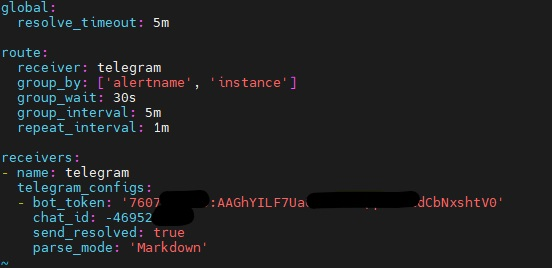

**4. Start the stack: (about 2-3 min)**

        docker-compose up -d

**5. Access services:**

        Prometheus: http://<IP-host-machine>:9090

        Grafana: http://<IP-host-machine>:3000

        Alertmanager: http://<IP-host-machine>:9093

### **📁 Folder Structure**

.
├── docker-compose.yml
├── prometheus.yml
├── http_502_alert.yml
├── config.yml               # Alertmanager config
├── blackbox.yml             # Blackbox config
├── grafana/
│   └── provisioning/        # Grafana datasource and dashboards
├── mysql/                  
│   ├── init.sql             # Grant permission account exporter
│   └── my.cnf               # Connect from mysql-exporter to mysql

## **🖼️ Result Screenshots:**

**🐳 Running Containers:**

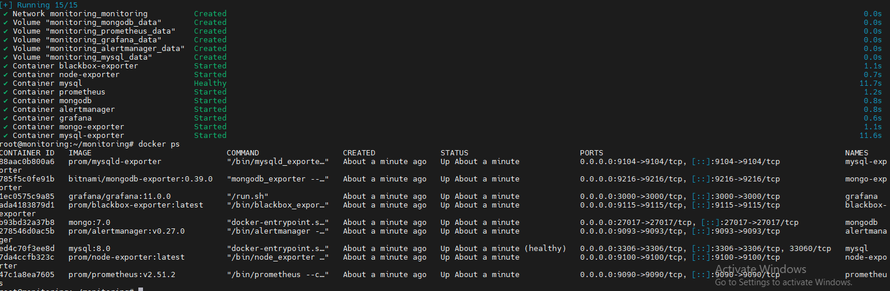

**📊 Grafana Dashboard:**

**Datasource:**

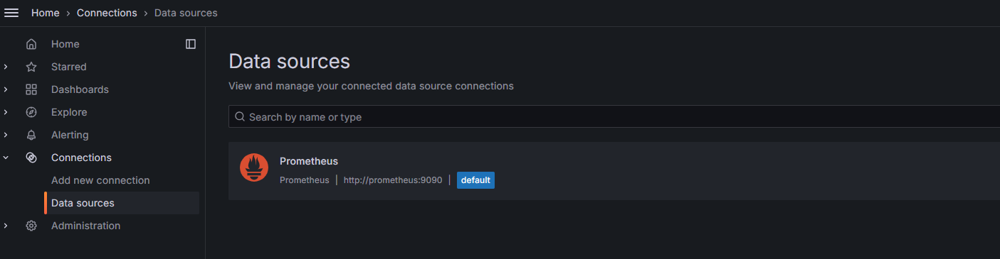

**Folder Dashboard:**

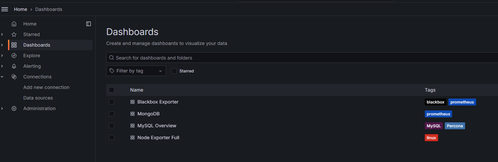

**Node-Exporter:**

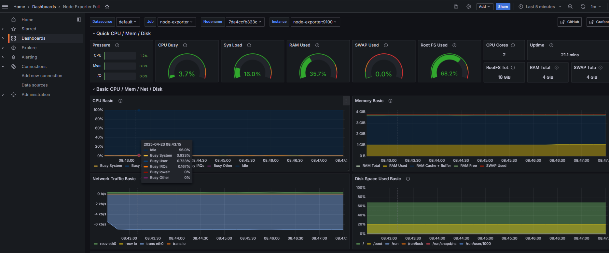

**MySQL:**

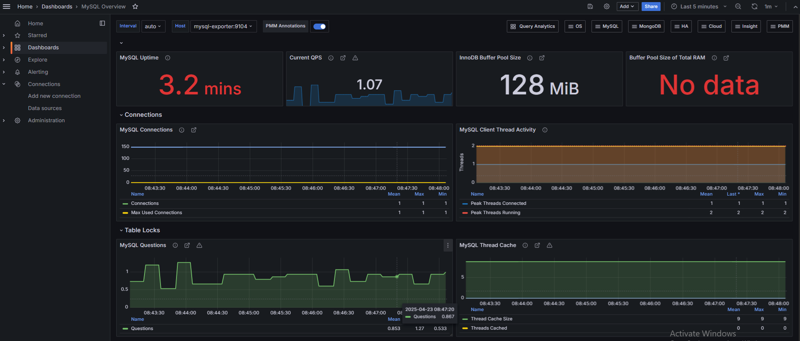

**MongoDB:**

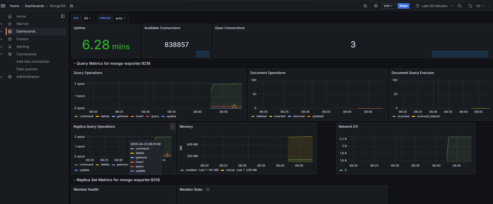

**Blackbox-Exporter:**

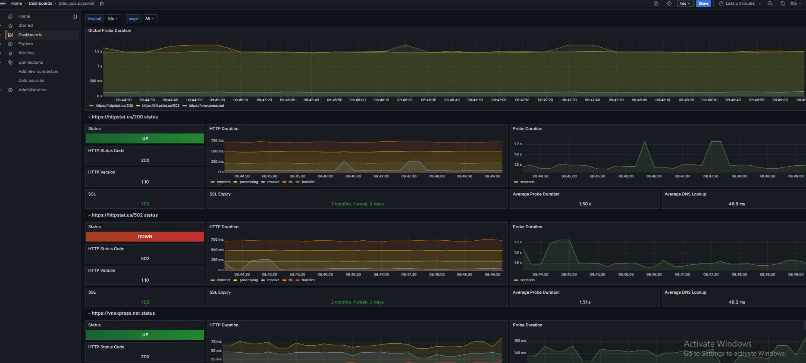

**🧠 Prometheus Targets:**

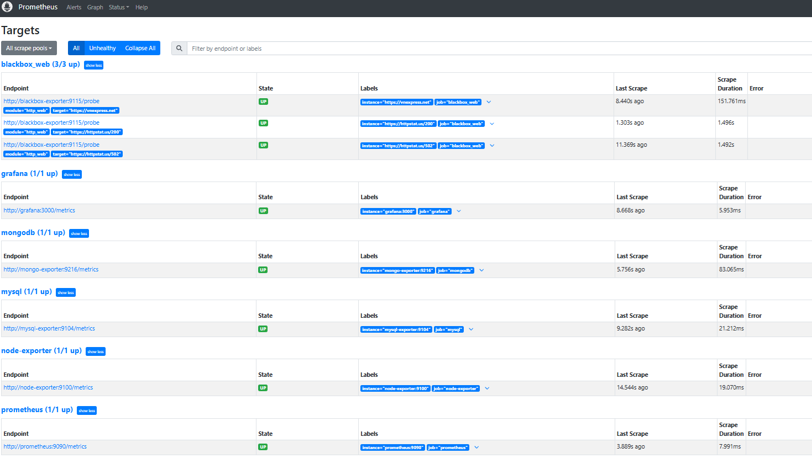
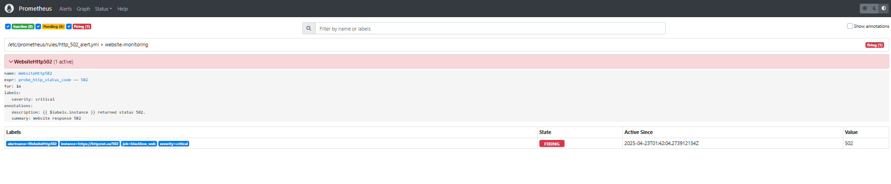

**🚨 Alertmanager:**

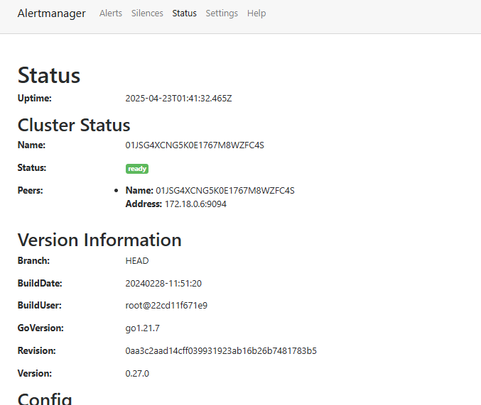
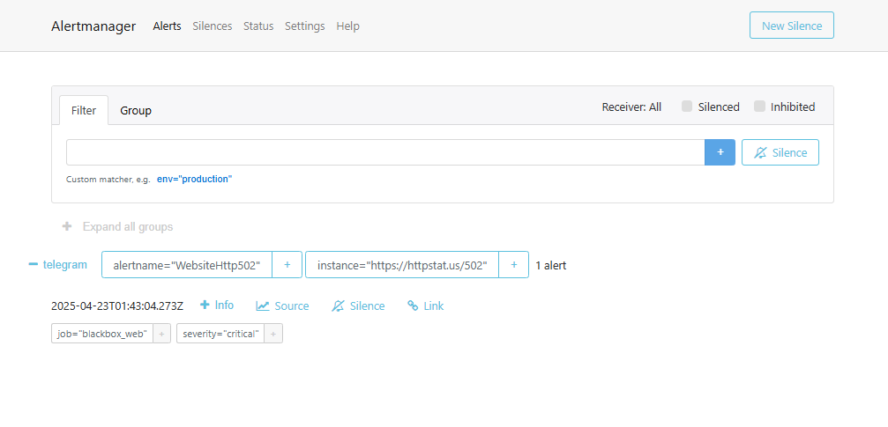

**📬 Telegram Alerts:**

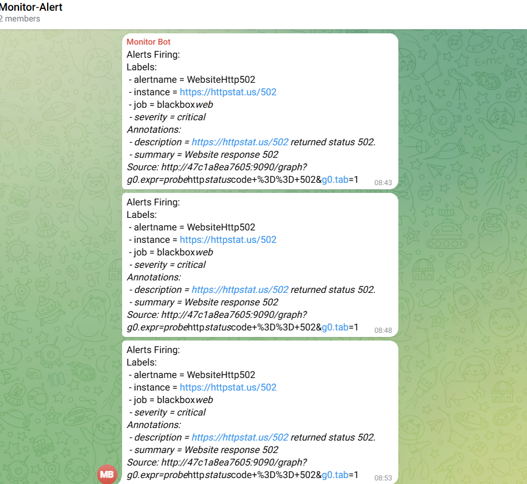

**🛠️ Notes:**

Ensure your custom config files (Prometheus, Blackbox, Alertmanager, etc.) are properly formatted before running the stack.

You can extend this setup with additional exporters depending on your use case.

